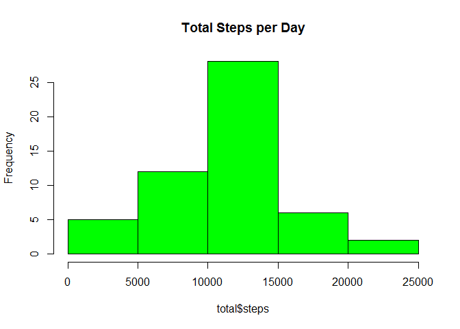
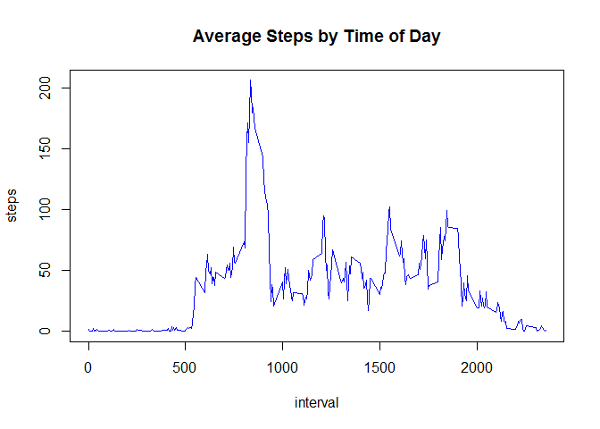
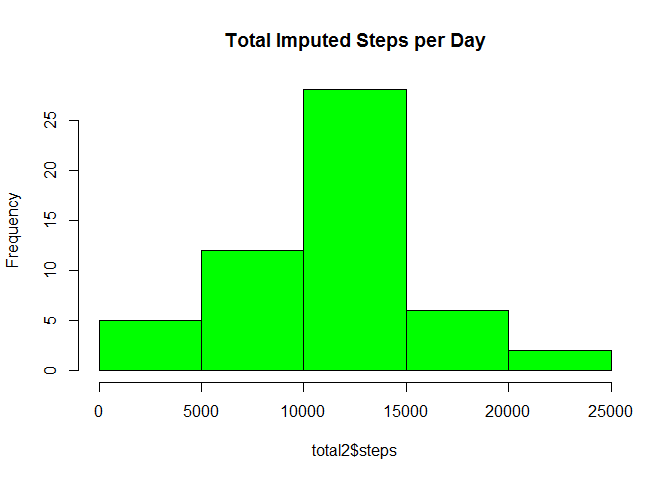
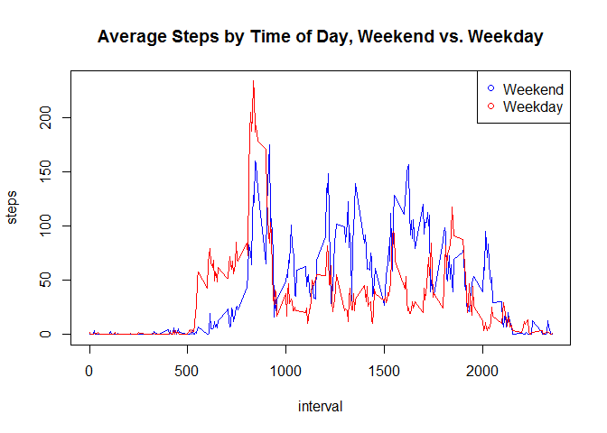

## Introduction

This assignment makes use of data from a personal activity monitoring
device. This device collects data at 5 minute intervals through out the day. The data consists of two months of data from an anonymous
individual collected during the months of October and November, 2012
and include the number of steps taken in 5 minute intervals each day. For more information, refer to the accompanying "README.md" document.

## To load and preprocess the data, the following code was used:


```r
PA1raw <- read.csv("activity.csv")
```


## What is the mean total number of steps taken per day? 
### This question was answered as follows:


```r
total <- aggregate(steps ~ date, PA1raw, FUN = sum)
hist(total$steps, col = "Green", main = "Total Steps per Day")
```

\

### The mean was calculated as follows. The answer should be "10766.19".


```r
mean(total$steps)
```

```
## [1] 10766.19
```

### The median was calculated as follows. The answer should be "10765".


```r
median(total$steps)
```

```
## [1] 10765
```


## What is the average daily activity pattern?
### This question was answered as follows:


```r
int_agg <- aggregate(steps ~ interval, PA1raw, FUN = mean)
with(int_agg, plot(interval, steps, type = "l", col = "blue",
      main = "Average Steps by Time of Day"))
```

\

### The interval with the max steps was calculated as follows. The answer should be interval "104".


```r
which.max(int_agg$steps)
```

```
## [1] 104
```

## Imputing missing values was accomplished as follows:

### Check how many NA values are in the dataset.The answer should be "2304". 


```r
sum(is.na(PA1raw))
```

```
## [1] 2304
```

### Mutate the NA values. 


```r
library("dplyr")
```

```
## Warning: package 'dplyr' was built under R version 3.2.3
```

```
## 
## Attaching package: 'dplyr'
```

```
## The following objects are masked from 'package:stats':
## 
##     filter, lag
```

```
## The following objects are masked from 'package:base':
## 
##     intersect, setdiff, setequal, union
```

```r
PA1imp <- PA1raw %>% 
  group_by(interval) %>%
  mutate(steps = replace(steps, is.na(steps), mean(steps, is.na = TRUE)))
```

### What is the new mean total number of steps taken per day?


```r
total2 <- aggregate(steps ~ date, PA1imp, FUN = sum)
hist(total2$steps, col = "Green", main = "Total Imputed Steps per Day")
```

\

### The mean was calculated as follows. The answer should be "10766.19".


```r
mean(total2$steps)
```

```
## [1] 10766.19
```

### The median was calculated as follows. The answer should be "10766.19".


```r
median(total2$steps)
```

```
## [1] 10765
```


## Are there differences in activity patterns between weekdays and weekends? 
### The answer to this question was calculated with the following:


```r
library(chron)
```

```
## Warning: package 'chron' was built under R version 3.2.3
```

```r
PA1imp$weekend <- is.weekend(as.Date(PA1imp$date))
int_agg2 <- aggregate(steps ~ weekend + interval, PA1imp, FUN = mean)
with(int_agg2, plot(interval, steps, main = "Average Steps by Time of Day, Weekend vs. Weekday", type = "n"))
with(subset(int_agg2, weekend == TRUE), points(interval, steps, type = "l", col = "blue"))
with(subset(int_agg2, weekend == FALSE), points(interval, steps, type = "l",col = "red"))
legend("topright", pch = 1, col = c("blue", "red"), legend = c("Weekend", "Weekday"))
```

\

This completes the assignment.
